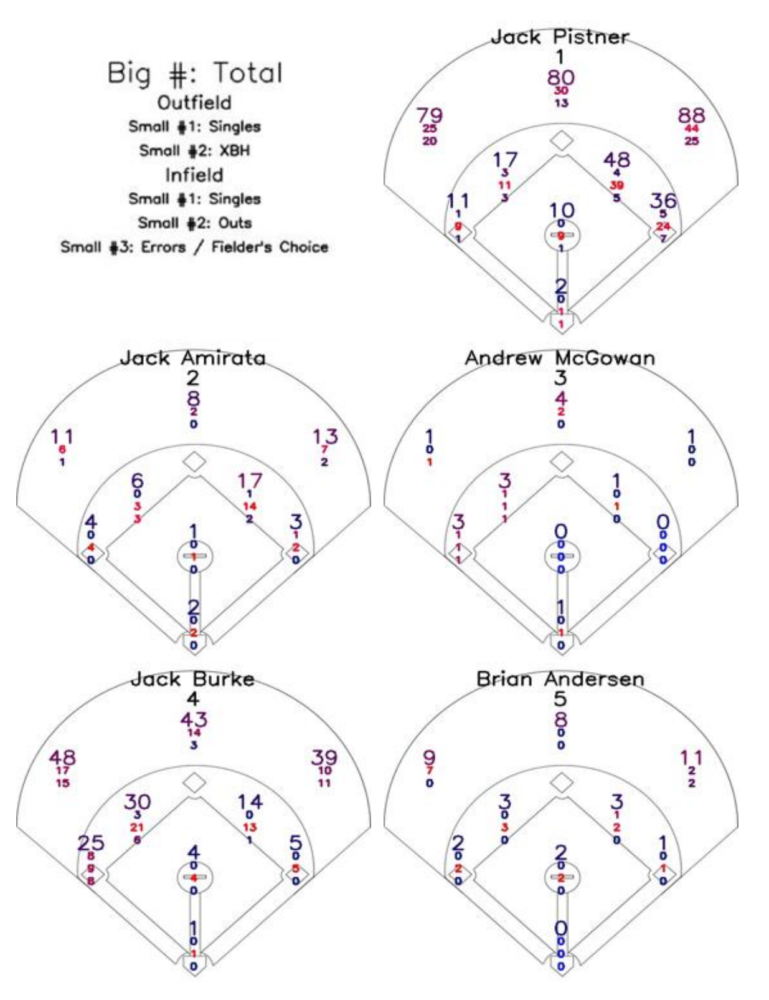

# Swarthmore Baseball Spray Charts

This project involves a Python script that scrapes data from the game logs of Division 3 baseball teams to produce spray charts for each individual player. The spray charts are then used to analyze the player's hitting tendencies and can be used to help coaches make decisions about how to position their fielders. This project was inspired by my involvement with the Swarthmore College baseball team; Despite a season ending injury during my senior season, I wanted to find a way to contribute to the team without being on the field.

## Methodology

1. Enter the name of the desired division 3 baseball team and their respective domain name
2. The school's schedules for the specified range of years is scraped for all the box score links
3. The school's roster site is scraped and enters each player's first name, last name, and number into a pandas database.
4. The play by play from each box score link is aggregated into a single csv file
5. The play by play csv file is parsed and analyzed
6. A 'spray chart' image is created for each player
7. The images for a team's players are combined into a pdf file

An example is shown below:

